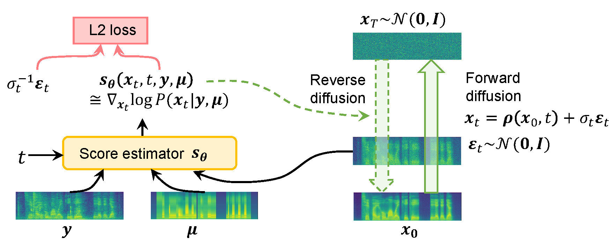

# DMSE4TTS
<p align="center">
    
</p>

Implementation of the DMSE model in "Diffusion-Based Mel-Spectrogram Enhancement for Text-to-Speech Synthesis with Found Data".


**Demo page** : [link]( https://dmse4tts.github.io/)

## Dependencies

You can install all Python package requirements with:

```bash
pip install -r requirements.txt
```

The code is tested on Python==3.9.16

## Inference
You can download the pretrained DMSEtext, DMSEbase and DMSEbase(VCTK) checkpoints [here](https://drive.google.com/drive/folders/1x1rffqITH1duSjnKjniWpIh0vf00MSL9?usp=sharing). Then put them in logs/cusent, logs/cusent_no_text and logs/vctk_no_text, respectively.

**w/o text transcription**:
If your audio clips for testing have no text transcriptions, you can use the DMSEbase or DMSEbase(VCTK) models for enhancement. See inference_no_text.sh as an example. Check out the folder `out` for enhanced output.
```python
python inference_no_text.py --train_config <your-config-file> --test_dir <path-to-wavfiles> --restore_file <chekpoint_name> -t 25
```

**with text transcription**:
If your audio clops for texting have text transcriptions, run MFA [(link)](https://montreal-forced-aligner.readthedocs.io/en/latest/) first to obtain TextGrid files. Then use the pretrained DMSEtext model for enhancement. See inference.sh as an example. Check out the folder `out` for enhanced output.
**Note**: the pretrained DMSEtext model currently only supports Cantonese speech.
```python
python inference.py --train_config <your-config-file> --test_dir <path-to-wavs-textgrids> --restore_file <checkpoint_name> -t 25
```

## Training
1. We used the DNS noise dataset [(link)](https://github.com/microsoft/DNS-Challenge) and the RIRs dataset [(link)](https://www.openslr.org/28/) to simulate the background noise and reverberation, respectively. The train/test splits are indicated in train_files/noise_train(test).txt, train_files/rir_train(test).txt.
2. Prepare experiment configuration file similar to configs/cusent.json (if with text), or configs/cusent_no_text.json and configs/vctk_no_text.json (if w/o text).
3. Prepare the training files with
```bash
sh preprocess.sh
```
4. Run training scripts. See train_cusent.sh/train_cusent_no_text.sh/train_vctk_no_text.sh as an example.
```python
python train.py --train_config <your-config-file> 
```
All logging information and checkpoints are stored in `log_dir`, which you should specify in `your-config-file` under the `training` section.

## References
* Audio degradation simulation is adapted from the DNS-Challenge repository [link](https://github.com/microsoft/DNS-Challenge) and the official VoiceFixer implementation [link](https://github.com/haoheliu/voicefixer_main).
* HiFi-Gan is used as the vocoder, but modifed to take 128-dim mel-spectrogram as input. Model parameters are fine-tuned from the official pretrained checkpoint [link](https://github.com/jik876/hifi-gan).
* DPM solver is used for solving the reverse diffusion equation. Offial implementation: [link](https://github.com/LuChengTHU/dpm-solver)
* Model architecture is adapted from GradTTS. Official implementation: [link](https://github.com/huawei-noah/Speech-Backbones/tree/main/Grad-TTS)
